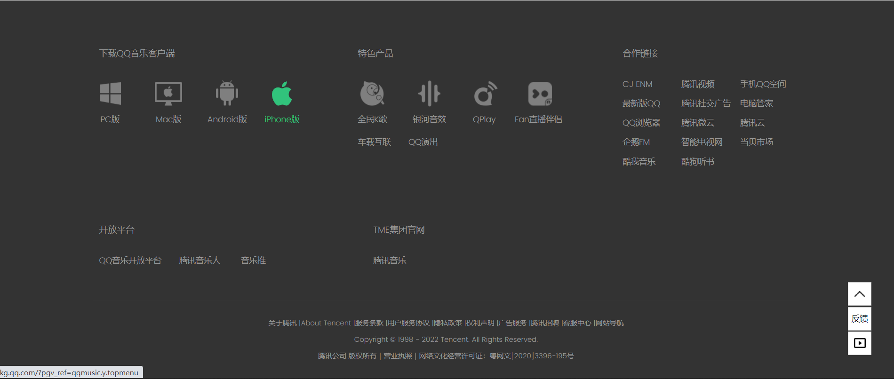

# vue2_cloud_music

## Project setup

```
npm install
```

### Compiles and hot-reloads for development
```
npm run serve
```

### Compiles and minifies for production
```
npm run build
```

### Lints and fixes files
```
npm run lint
```

### Customize configuration
See [Configuration Reference](https://cli.vuejs.org/config/).

# 组件

## 轮播器

- [ ] 轮播内容可自定义（插槽）
- [ ] 内容数量可自定义
- [ ] 滑动可调节轮播内容
- [ ] 容器中有小圆点并显示当前内容为第几部分
- [ ] 点击小圆点可轮播至该内容
- [ ] 左右有箭头调节
- [ ] 箭头之间的距离由内容宽度决定


## 专辑

- [x] 专辑图片可自定义
- [x] 专辑样式可自定义
- [x] 播放暂停会有响应动画（专辑旋转…）


## 底部栏

- [ ] 默认宽度100%
- [ ] 样式可自定义
- [ ] 说明信息



# 	BUG

