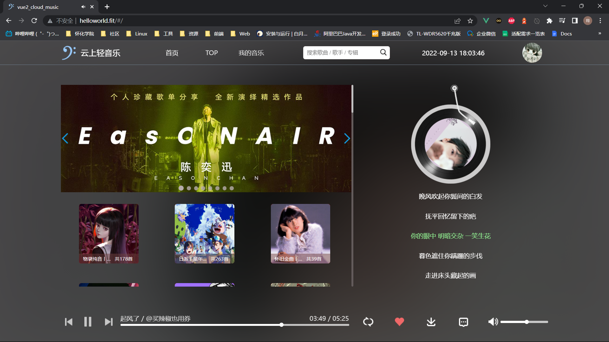
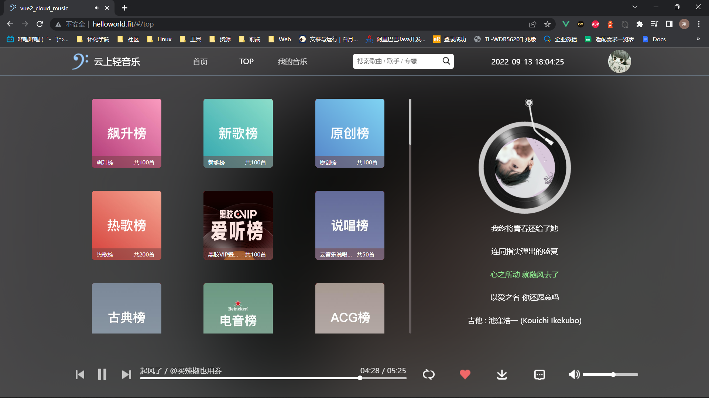
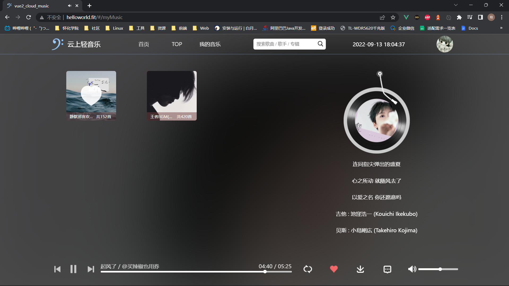
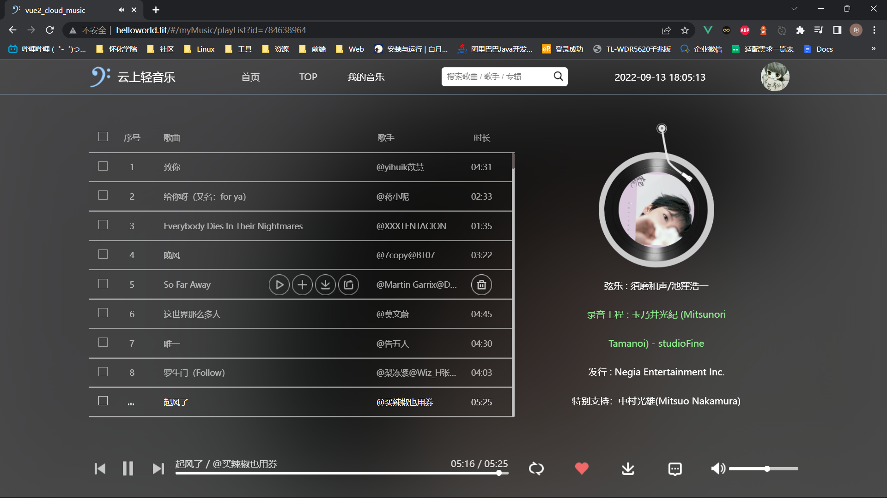
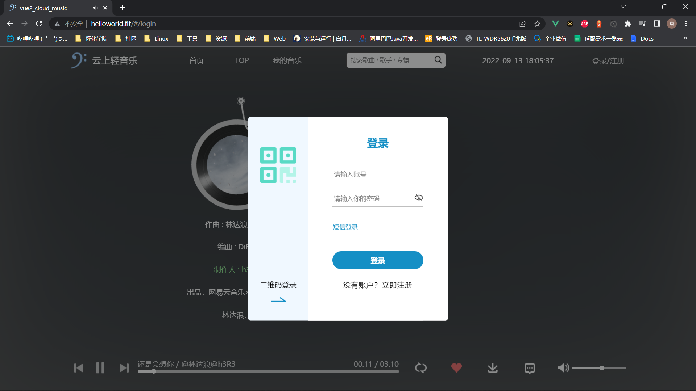
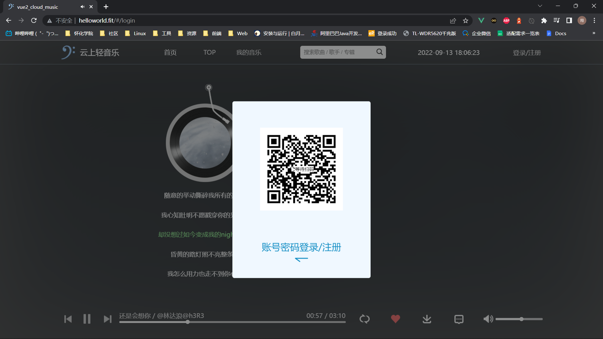
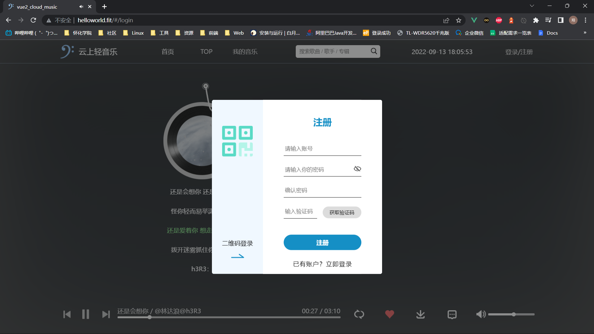

# 云上轻音乐

## Project setup

```
npm install
```

### Compiles and hot-reloads for development
```
npm run serve
```

### Compiles and minifies for production
```
npm run build
```

### Lints and fixes files
```
npm run lint
```

## 项目介绍

- 注：本项目为音乐网站，仅用于学习交流
- 技术栈：HTML、CSS、Less、JS、ES6、Vue2、Vue-Router、Axios、Git
- 功能实现：图片轮播、登录（账号密码登录、网易云扫码登录）、注册、播放歌曲（随机、单曲循环、顺序）、暂停歌曲、拖动进度条快进歌曲、上一曲、下一曲、收藏歌曲、歌词滚动、搜索歌曲、下载歌曲（若功能出错则可能是网易云后台接口地址或参数发生改变）
- 歌曲数据及用户数据来源于网易云，与网易云数据同步（相当于换皮网易云网页版）
- 项目后台Github地址：https://github.com/Binaryify/NeteaseCloudMusicApi
- 本项目线上网址：http://helloworld.fit

## 界面截图

### 首页



### TOP



### 我的



### 歌单页



### 账号密码登录



### 网易云扫码登录



### 注册



